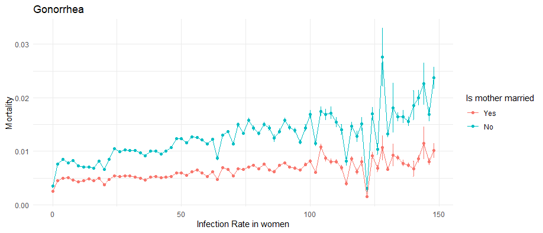
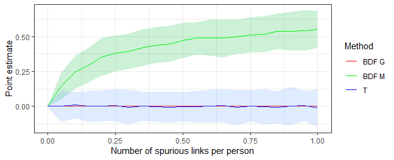
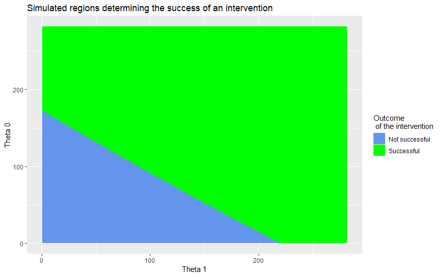

### <a href="KrzysztofZaremba/KrzysztofZaremba.github.io/files/Hotels_Opening_KZ.pdf" target="_blank"> Opening of hotels and ski facilities: impact on mobility and Covid-19 outcomes </a>

This paper investigates how the opening of hotels and ski facilities in Poland impacted mobility and
Covid-19 outcomes. Leveraging geolocation data from Facebook, we show that ski resorts experienced a
significant influx of tourists, increasing the number of local users by up to 50%. Furthermore, we show
that there was an increase in the probability of meetings between pairs of users from distanced locations
and pairs of users from touristic and non-touristic areas. As the policy impacted travels and gatherings,
we then analyze its effect on the diffusion of Covid-19. We find a significant association between touristic
movements and the severity of a major pandemic wave in Poland. In particular, we observe that counties
with ski facilities experienced more infections after the opening. Moreover, counties strongly connected
to the ski resorts during the opening had more subsequent cases than weakly connected counties.

### The Effects of Prenatal Exposure to Sexually Transmitted Diseases 

Sexually transmitted diseases are on the rise. They are particularly harmful among pregnant women as they can cause stillbirth, preterm birth, and infections in newborns. Since the fetus development is at risk, STD in utero can affect a child's long-term outcomes. In this project, I exploit quarterly state variation in the number of Gonorrhea and Chlamydia cases to investigate the disease's impact on adult outcomes.

 
 

### Who are you sneezing at: Role of networks in spreading the flu

Epidemics can have devastating health and economic consequences. This paper studies the diffusion of flu through the social and economic networks. Using 15 years of weekly, county level infection data it answers three questions. Firstly, it evaluates the impact of school closures on viral transmission. The results show that closing schools for two weeks decreases number of flu cases by 30-40%. The decline in infections extends to elderly and pre-school children. In addition, a drop in flu related hospitalizations follows a closure.  Secondly, paper demonstrates significant contribution of economic links to the diffusion. The disease follows paths of worker commuting between home and workplace. Together with the structure of the labor mobility networks, these results highlight the central role of regional capitals in sustaining and spreading the virus. Thirdly, this paper takes advantage of high frequency outcome data to endogenously recover the intensity of social interactions between counties.

 
 

### Beware of fake friends: Spurious links and peer effects in networks

This paper discusses the robustness of the widely used IV method of estimating peer effects (from Bramoullé , 2009) to spurious links. Spurious links are "false positive" connections which do not exist in reality, but are observed by a researcher. I show that this estimator is inconsistent when spurious links are present and it can indicate significant peer effects even if there are none. Next I suggest an unbiased test for the existence of peer effects and show its performance in simulations. 

### Spreading new habits

Various behaviors of economic relevance, such as condom use or hand washing, are subject to habitual practice. This paper takes into account the habit formation to model the spread of new behaviors on networks. It augments traditional models of diffusion by a novel insight: the probability of abandoning a new behavior decreases with the time spent practicing it.  Three main results concerning interventions aiming to diffuse new behaviors stem from the augmented models. Firstly, repeated interventions are more successful at establishing new behaviors that require a long habit formation process. Secondly, there exists a trade-off between the minimum number of initial adopters needed to spread the behavior and intervention duration.  Thirdly, habit formation can introduce non-monotonicities in adoption patterns in time, identifying behaviors prone to habit. 
