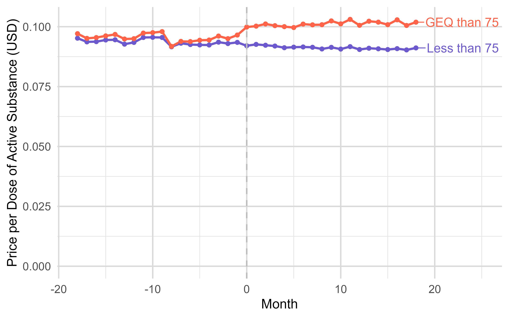
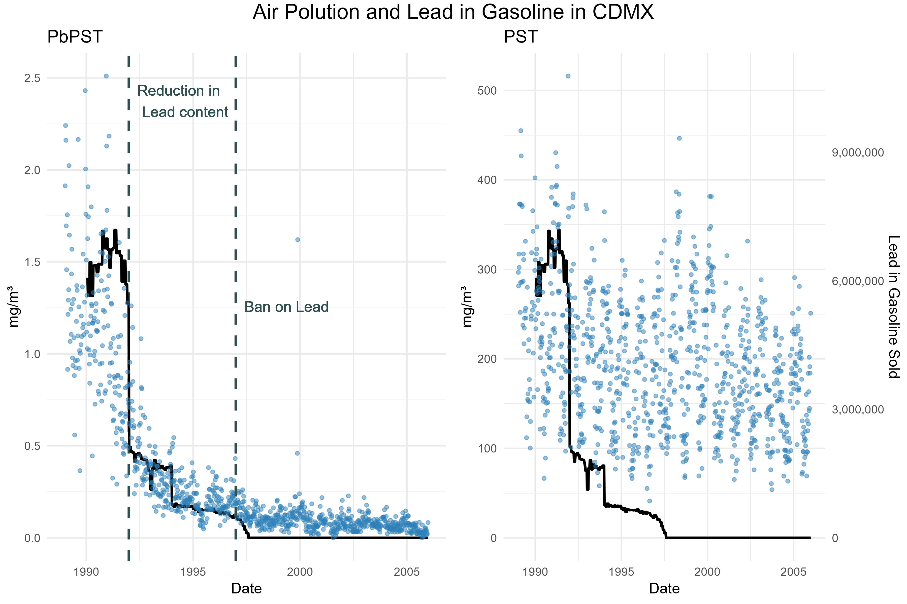

Click on an arrow to see the abstract

## Working Papers

 
 <b> <a href="https://krzysztofzaremba.github.io/files/Majewska_Zaremba.pdf" target="_blank"> Universal Subsidies in Pharmaceutical Markets: Lessons from Poland’s Drugs 75+ Policy</a>  </b> with Gosia Majewska 
 
 

 

 Abstract 

  
   

Widely used public policies fully subsidizing essential goods and services aim to improve access, but removing price signals may also produce distortions. We investigate this problem by leveraging Poland’s Drugs 75+ program, which provides free prescription medications to individuals aged 75 and older, as a natural experiment. Using a difference-in-discontinuities approach, event studies, and detailed administrative and survey data, we draw three main conclusions. First, the program reduced out-of-pocket medication expenditures for seniors, substantially alleviating the risk of catastrophic health costs. Second, it improved access: medication consumption increased, particularly for higher-cost products, to some extent displacing cheaper alternatives. Third, the shift in consumption patterns increased public payer costs per dose of treatment. These findings highlight the challenges of subsidy programs that eliminate price signals, as they can alter demand in ways that improve access but undermine cost-effectiveness.

   

 

 

 

 
 <b> <a href="https://papers.ssrn.com/sol3/papers.cfm?abstract_id=5214598" target="_blank"> Lead Effects Through Generations</a>  </b> with Xinming Du (Reject & Resubmit at the Journal of Public Economics) 
 
 

 

 Abstract 

  
   

While economic and health dynamics across generations have been well studied, the role of environmental factors in driving intergenerational persistence remains underexplored. This paper examines the first- and second-generation effects of leadborne pollution on health and fertility outcomes. We exploit the phase-out of leaded gasoline in Mexico in the 1990s, which led to a sharp decline in air lead pollution. Using a shift-share design to identify variation in prenatal lead exposure, we find that a full reduction in lead exposure results in a 1.97 per thousand reduction in fetal deaths, a 0.53 per thousand increase in birth rates, and a 3.33 per thousand decrease in infant mortality. Female children exposed to higher in-utero lead levels are more likely to give birth earlier and less likely to migrate.  In the second generation, the effects of in utero exposure vary by local socioeconomic conditions: in better-off municipalities,  long-term effects are null, whereas in marginalized municipalities,  children of exposed mothers experience significantly lower birth weights and elevated rates of preterm birth. These findings highlight how structural disadvantage mediates the intergenerational transmission of environmental shocks.

   

 

 

 

 
 <b> <a href="https://papers.ssrn.com/sol3/papers.cfm?abstract_id=5218496" target="_blank"> The Role of Dating Markets in Shaping Maternal and Neonatal
Health: Evidence from Sex Ratios at Birth</a>  </b>  (Reject & Resubmit at the Journal of Public Economics) 

 

 Abstract 

  
   

		This paper provides the first causal evidence on how the strength of women’s position in the dating market influences maternal and neonatal health outcomes. I proxy the strength of women’s position by the availability of adult male partners. I introduce a novel instrument based on randomness in sex at birth to address the endogeneity of this variable. A stronger female position in the dating market leads to a reduction in out-of-wedlock births, lowers rates of chlamydia and hypertension in mothers, and decreases the incidence of low APGAR scores in newborns. Connecting this to racial health disparities, Black women’s limited partner prospects contribute to 5-10% of the racial health gap. Eliminating racial disparities in incarceration would prevent 200-700 adverse outcomes annually among Black mothers.

   
 

 

 

 
 <b> <a href="https://krzysztofzaremba.github.io/files/Household_penalty_Chicago.pdf" target="_blank"> Household Penalty:
Gendered Costs of Spousal Infectious Diseases on
Labor and Health</a>  </b> with Xinming Du (R&R in the Economic Development and Cultural Change) 
 
 

 

 Abstract 

  
   

This paper examines the gendered impact of spousal health shocks on labor and health outcomes. Using Mexican labor surveys and a difference-in-differences approach, we find women’s labor supply decreases by 15% after a partner’s health shock, compared to a 10% reduction for men. A significant part of this is driven by women’s higher probability of household infection. Analysis of U.S. insurance claims shows a partner’s infection increases infection risk by 1.2 percentage points for men and 2.2 for women. Household specialization underpins these effects: as women’s income share rises, their penalty decreases while men’s increases.

   

 

## Published Papers

 <b> <a href="https://krzysztofzaremba.github.io/files/KZ_Flu.pdf" target="_blank"> School Closures and Respiratory Infections Transmission and Mortality: Evidence from School Holidays in Poland</a> </b> <em> American Journal of Epidemiology, 2024 </em> 

 Abstract 

  

 

This study examines the impact of temporary school closures on influenza transmission and respiratory mortality, leveraging a natural experiment from winter break timings in Polish schools. Analyzing 12 years of ILI (Influenza-Like Illness) data and two decades of respiratory death records, findings indicate significant reductions in ILI incidence post-closures: 75% among schoolaged children, 55% in adults, 52% in pre-school children, and 41% in the elderly. Notably, a 7% decrease in respiratory mortality was observed among the elderly, highlighting school closures as an effective public health intervention for reducing influenza spread and mortality among high-risk groups.

  

   

 

 

 

 <b> <a href="https://krzysztofzaremba.github.io/files/Hotels_Opening_KZ.pdf" target="_blank"> Opening of hotels and ski facilities: Impact on mobility, spending, and Covid-19 outcomes</a> </b> <em> Health Economics, 2023. </em>   

 

 Abstract

  

 

 
This paper investigates how reopening hotels and ski facilities in Poland impacted tourism spending, mobility, and COVID-19 outcomes. We used administrative data from a government program that subsidizes travel to show that the policy increased the consumption of tourism services in ski resorts. By leveraging geolocation data from Facebook, we showed that ski resorts experienced a significant influx of tourists, increasing the number of local users by up to 50%. Furthermore, we confirmed an increase in the probability of meetings between pairs of users from distanced locations and users from tourist and non-tourist areas. As the policy impacted travel and gatherings, we then analyzed its effect on the diffusion of COVID-19. We found that counties with ski facilities experienced more infections after the reopening. Moreover, counties strongly connected to the ski resorts during the reopening had more subsequent cases than weakly connected counties. Cost-benefit analysis shows that costs stemming from additional hospitalizations and deaths vastly outweighed the economic benefits of reopening, even in the ski resorts.
  
 

 
  

 

 
  

## Work in Progress

<b>  Beware of Fake Friends: Spurious Links and Peer Effects in Networks</b>

