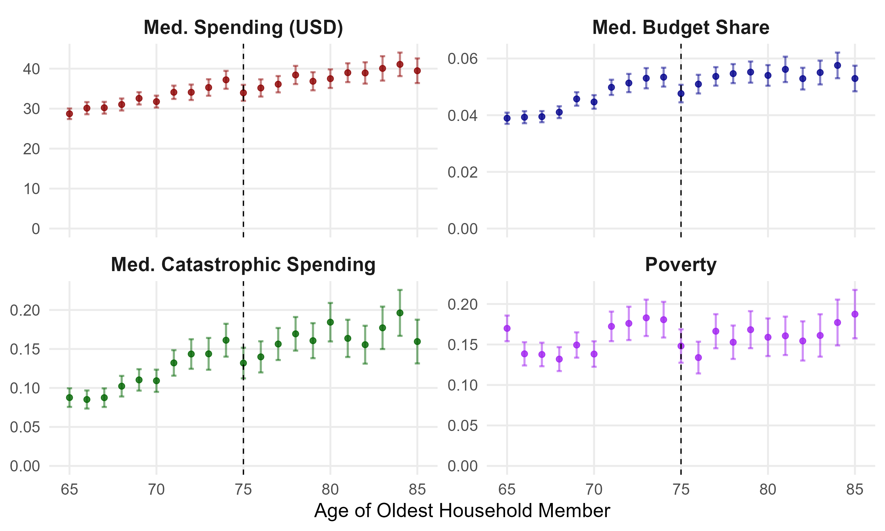
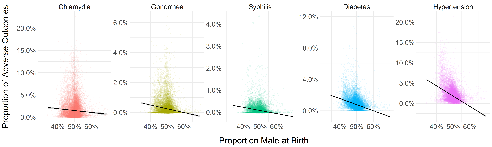

.paper-card {
  border: 1px solid #ddd;
  border-radius: 6px;
  padding: 0.8em 1em;
  margin-bottom: 1.2em;
  box-shadow: 0 1px 3px rgba(0,0,0,0.06);
  font-size: 0.9em;
  max-width: 1400px;   /* wider on big screens */
  margin-left: auto;
  margin-right: auto;
}

.paper-flex {
  display: flex;
  gap: 1em;
  align-items: flex-start;
  margin-top: 0.8em;
}

.abstract {
  flex: 3;   /* text column takes ~75% */
  font-size: 0.85em;
  text-align: justify;
  line-height: 1.4;
}

.paper-image {
  flex: 1;   /* image column ~25% */
}

.paper-image img {
  max-width: 600px;   
  object-fit: contain;
  border-radius: 4px;
  box-shadow: 0 1px 3px rgba(0,0,0,0.1);
}

/* 📱 Responsive rule: on screens <= 768px (phones) stack vertically */
@media (max-width: 768px) {
  .paper-flex {
    flex-direction: column;  /* stack instead of side-by-side */
  }
  .paper-image {
    margin-top: 0.8em;
  }
  .paper-image img {
    max-width: 100%;   /* let image expand naturally on phone */
    max-height: none;
  }
}

---

## 📄 Working Papers

  <h3>
    <a href="https://krzysztofzaremba.github.io/files/Majewska_Zaremba.pdf" target="_blank">
      Universal Subsidies in Pharmaceutical Markets: Lessons from Poland’s Drugs 75+ Policy
    </a>
    Working Paper
  </h3>
  
<em>with Gosia Majewska</em>

  

    
<em>Click to view abstract & figure</em>

    

      

        Widely used public policies fully subsidizing essential goods and services aim to improve access, but removing price signals may also produce distortions. We investigate this problem by leveraging Poland’s Free Drugs for Seniors program, which provides free prescription medications to individuals above an age threshold, as a natural experiment. Using event studies, detailed administrative and survey data, we draw two main conclusions. First, the program improved access: medication consumption increased, particularly for higher-cost products, to some extent displacing cheaper alternatives. Second, the shift in consumption patterns increased public payer costs per dose of treatment. These findings highlight the challenges of subsidy programs that eliminate price signals, as they can alter demand in ways that improve access but undermine cost-effectiveness.
      

      

        
      

    

  

  <h3>
    <a href="https://krzysztofzaremba.github.io/files/budgets.pdf" target="_blank">
      The Financial and Behavioral Effects of Free Prescription Drugs: Evidence from a Policy Discontinuity in Poland
    </a>
    R&R at Health Economics
  </h3>
  
<em>with Gosia Majewska</em>

  

    
<em>Click to view abstract & figure</em>

    

      

        We provide causal evidence on the financial consequences and moral hazard effects of a universal prescription drug subsidy for seniors—a policy widely implemented in many countries. Our analysis leverages Poland’s introduction of such a subsidy, which fully eliminated out-of-pocket costs for selected medications at age 75. Exploiting the sharp age eligibility threshold and policy timing, we apply a difference-in-discontinuities design to detailed household expenditure data. We find substantial reductions in medication spending and a 62% decrease in catastrophic drug expenditures, indicative of a strong insurance effect. However, these financial gains disproportionately accrued to wealthier households, raising distributional concerns. We also document increased household spending on alcohol and cigarettes, consistent with ex ante moral hazard. These findings demonstrate that while universal drug subsidies effectively reduce financial risk among older adults, they may also induce unintended behavioral responses and amplify existing inequities.
      

      

        
      

    

  

  <h3>
    <a href="https://papers.ssrn.com/sol3/papers.cfm?abstract_id=5214598" target="_blank">
      Lead Effects Through Generations
    </a>
    R&R at Journal of Public Economics
  </h3>
  
<em>with Xinming Du</em>

  

    
<em>Click to view abstract & figure</em>

    

      

        While economic and health dynamics across generations have been well studied, the role of environmental factors in driving intergenerational persistence remains underexplored. This paper examines the first- and second-generation effects of leadborne pollution on health and fertility outcomes. We exploit the phase-out of leaded gasoline in Mexico in the 1990s, which led to a sharp decline in air lead pollution. Using a shift-share design to identify variation in prenatal lead exposure, we find that a full reduction in lead exposure results in a 1.97 per thousand reduction in fetal deaths, a 0.53 per thousand increase in birth rates, and a 3.33 per thousand decrease in infant mortality. Female children exposed to higher in-utero lead levels are more likely to give birth earlier and less likely to migrate. In the second generation, the effects of in utero exposure vary by local socioeconomic conditions: in better-off municipalities, long-term effects are null, whereas in marginalized municipalities, children of exposed mothers experience significantly lower birth weights and elevated rates of preterm birth. These findings highlight how structural disadvantage mediates the intergenerational transmission of environmental shocks.
      

      

        
      

    

  

  <h3>
    <a href="https://papers.ssrn.com/sol3/papers.cfm?abstract_id=5218496" target="_blank">
      The Role of Dating Markets in Shaping Maternal and Neonatal Health: Evidence from Sex Ratios at Birth
    </a>
    R&R at Journal of Public Economics
  </h3>
  

    
<em>Click to view abstract & figure</em>

    

      

        This paper provides the first causal evidence on how the strength of women’s position in the dating market influences maternal and neonatal health outcomes. I proxy the strength of women’s position by the availability of adult male partners. I introduce a novel instrument based on randomness in sex at birth to address the endogeneity of this variable. A stronger female position in the dating market leads to a reduction in out-of-wedlock births, lowers rates of chlamydia and hypertension in mothers, and decreases the incidence of low APGAR scores in newborns. Connecting this to racial health disparities, Black women’s limited partner prospects contribute to 5–10% of the racial health gap. Eliminating racial disparities in incarceration would prevent 200–700 adverse outcomes annually among Black mothers.
      

      

        
      

    

  

  <h3>
    <a href="https://krzysztofzaremba.github.io/files/Household_penalty_Chicago.pdf" target="_blank">
      Household Penalty: Gendered Costs of Spousal Infectious Diseases on Labor and Health
    </a>
    R&R at EDCC
  </h3>
  
<em>with Xinming Du</em>

  

    
<em>Click to view abstract</em>

    

      

        This paper examines the gendered impact of spousal health shocks on labor and health outcomes. Using Mexican labor surveys and a difference-in-differences approach, we find women’s labor supply decreases by 15% after a partner’s health shock, compared to a 10% reduction for men. A significant part of this is driven by women’s higher probability of household infection. Analysis of U.S. insurance claims shows a partner’s infection increases infection risk by 1.2 percentage points for men and 2.2 for women. Household specialization underpins these effects: as women’s income share rises, their penalty decreases while men’s increases.
      

      

    

  

---

## ✅ Published Papers

  <h3>
    <a href="https://krzysztofzaremba.github.io/files/KZ_Flu.pdf" target="_blank">
      School Closures and Respiratory Infections Transmission and Mortality: Evidence from School Holidays in Poland
    </a>
    American Journal of Epidemiology, 2024
  </h3>
  

    
<em>Click to view abstract & figure</em>

    

      

        This study examines the impact of temporary school closures on influenza transmission and respiratory mortality, leveraging a natural experiment from winter break timings in Polish schools. Analyzing 12 years of ILI (Influenza-Like Illness) data and two decades of respiratory death records, findings indicate significant reductions in ILI incidence post-closures: 75% among school-aged children, 55% in adults, 52% in pre-school children, and 41% in the elderly. Notably, a 7% decrease in respiratory mortality was observed among the elderly, highlighting school closures as an effective public health intervention for reducing influenza spread and mortality among high-risk groups.
      

      

        
      

    

  

  <h3>
    <a href="https://krzysztofzaremba.github.io/files/Hotels_Opening_KZ.pdf" target="_blank">
      Opening of Hotels and Ski Facilities: Impact on Mobility, Spending, and Covid-19 Outcomes
    </a>
    Health Economics, 2023
  </h3>
  

    
<em>Click to view abstract & figure</em>

    

      

        This paper investigates how reopening hotels and ski facilities in Poland impacted tourism spending, mobility, and COVID-19 outcomes. We used administrative data from a government program that subsidizes travel to show that the policy increased the consumption of tourism services in ski resorts. By leveraging geolocation data from Facebook, we showed that ski resorts experienced a significant influx of tourists, increasing the number of local users by up to 50%. Furthermore, we confirmed an increase in the probability of meetings between pairs of users from distanced locations and users from tourist and non-tourist areas. As the policy impacted travel and gatherings, we then analyzed its effect on the diffusion of COVID-19. We found that counties with ski facilities experienced more infections after the reopening. Moreover, counties strongly connected to the ski resorts during the reopening had more subsequent cases than weakly connected counties. Cost-benefit analysis shows that costs stemming from additional hospitalizations and deaths vastly outweighed the economic benefits of reopening, even in the ski resorts.
      

      

        
      

    

  

---

## 🔧 Work in Progress

  <h3>
    Beware of Fake Friends: Spurious Links and Peer Effects in Networks
    Work in Progress
  </h3>

