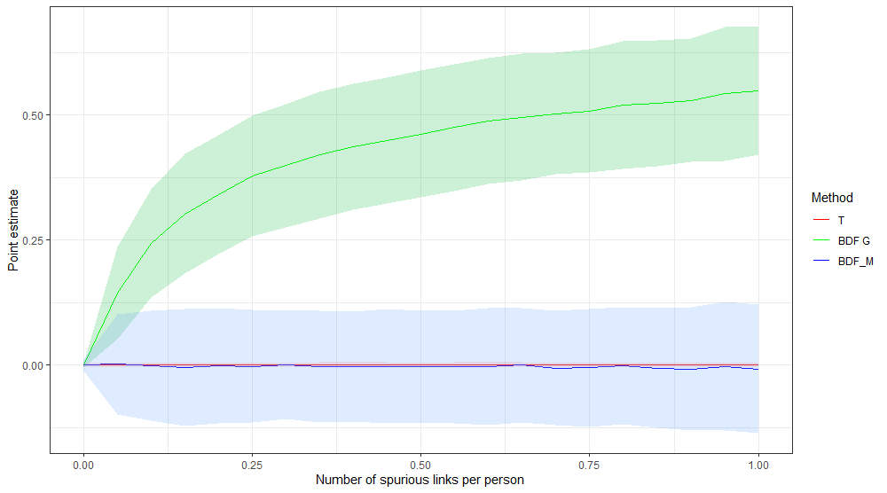

## Job Market Paper 

 
  
 <b> Effects of Intrahousehold Bargaining Power on the Maternal and Neonatal Health </b> 

  <table border="0">
    <tr>
      <td > This project aims to investigate the impact of intrahousehold bargaining power on maternal and neonatal health. We identify changes in bargaining power through deviations from a balanced sex ratio, which has been shown to play an essential role among the determinants of spouses’ respective bargaining power. To obtain causal estimates, contemporaneous sex ratio is instrumented with sex ratio at birth of a cohort. Next, using Vital Statistics Natality data, we evaluate the impact of the 
bargaining power on the mothers’ health and birth outcomes. </td>
 <td>  </td>
        </tr>
   </table> 

## Working Papers

### <a href="https://krzysztofzaremba.github.io/files/Hotels_Opening_KZ.pdf" target="_blank"> Opening of hotels and ski facilities: impact on mobility, spending, and Covid-19 outcomes</a> <em> (R&R in Health Economics) </em>

This paper investigates how the opening of hotels and ski facilities in Poland impacted touristic
spending, mobility and Covid-19 outcomes. We use administrative data from a government program
subsidizing travel to show that the policy increased consumption of touristic services in ski resorts. Next,
leveraging geolocation data from Facebook, we show that ski resorts experienced a significant influx of
tourists, increasing the number of local users by up to 50%. Furthermore, we show that there was an
increase in the probability of meetings between pairs of users from distanced locations and pairs of users
from touristic and non-touristic areas. As the policy impacted travels and gatherings, we then analyze
its effect on the diffusion of Covid-19. We find a significant association between touristic movements
and the severity of a major pandemic wave in Poland. In particular, we observe that counties with ski
facilities experienced more infections after the opening. Moreover, counties strongly connected to the ski
resorts during the opening had more subsequent cases than weakly connected counties.

 
 

### <a href="https://krzysztofzaremba.github.io/files/KZ_Flu.pdf" target="_blank"> Who are you sneezing at: Role of networks in spreading the flu</a>

Epidemics can have devastating health and economic consequences. This paper studies the diffusion of flu through social and economic
networks. Using almost two decades of weekly, county-level infection and mortality data from Poland, it examines within and across-counties flu transmission. Firstly, it evaluates the causal effect of school closures on viral transmission. The results show that closing schools for two weeks decreases the number of within county flu cases by 30-40%. The decline in infections extends to elderly and pre-school children. In addition, flu-related hospitalizations drop by 7.5%, and mortality related to respiratory diseases among the elderly drops by 3%. Secondly, the paper demonstrates a significant contribution of economic links to the diffusion across counties. The disease follows the paths of workers commuting between home and workplace. Together with the structure of the labor mobility networks, these results highlight the central role of regional capitals in sustaining and spreading the virus.

## Work in Progress

### Racial Disparities in Sexual Health and the Medicaid Expansion

The prevalence of sexually transmitted diseases (STD) among black pregnant women is at least three times higher than white pregnant women. This project aims to further document racial inequalities in the prevalence of STDs and their consequences for maternal and neonatal health. Next, it attempts to understand the drivers of these inequalities. In particular, the project focuses on the role of health insurance and access to healthcare as causes of STD disparities. To measure the impact of insurance, I take advantage of the expansion of Medicaid eligibility related to the Affordable Care Act, which provided many underprivileged Americans with health insurance. By using a difference-in-differences framework and double robust estimation techniques, I analyze if the subsequent reduction in racial insurance gap
affected inequalities in the STD prevalence.

 
 

### The Effects of Prenatal Exposure to Sexually Transmitted Diseases 

Sexually transmitted diseases are on the rise. They are particularly harmful among pregnant women as they can cause stillbirth, preterm birth, and infections in newborns. Since the fetus development is at risk, STD in utero can affect a child's long-term outcomes. In this project, I exploit quarterly state variation in the number of Gonorrhea and Chlamydia cases to investigate the disease's impact on adult outcomes.

 
 

### Beware of Fake Friends: Spurious Links and Peer Effects in Networks

This paper discusses the robustness of the widely used IV method of estimating peer effects (from Bramoullé , 2009) to spurious links. Spurious links are "false positive" connections which do not exist in reality, but are observed by a researcher. I show that this estimator is inconsistent when spurious links are present and it can indicate significant peer effects even if there are none. Next I suggest an unbiased test for the existence of peer effects and show its performance in simulations. 

### Spreading New Habits

Various behaviors of economic relevance, such as condom use or hand washing, are subject to habitual practice. This paper takes into account the habit formation to model the spread of new behaviors on networks. It augments traditional models of diffusion by a novel insight: the probability of abandoning a new behavior decreases with the time spent practicing it.  Three main results concerning interventions aiming to diffuse new behaviors stem from the augmented models. Firstly, repeated interventions are more successful at establishing new behaviors that require a long habit formation process. Secondly, there exists a trade-off between the minimum number of initial adopters needed to spread the behavior and intervention duration.  Thirdly, habit formation can introduce non-monotonicities in adoption patterns in time, identifying behaviors prone to habit. 
