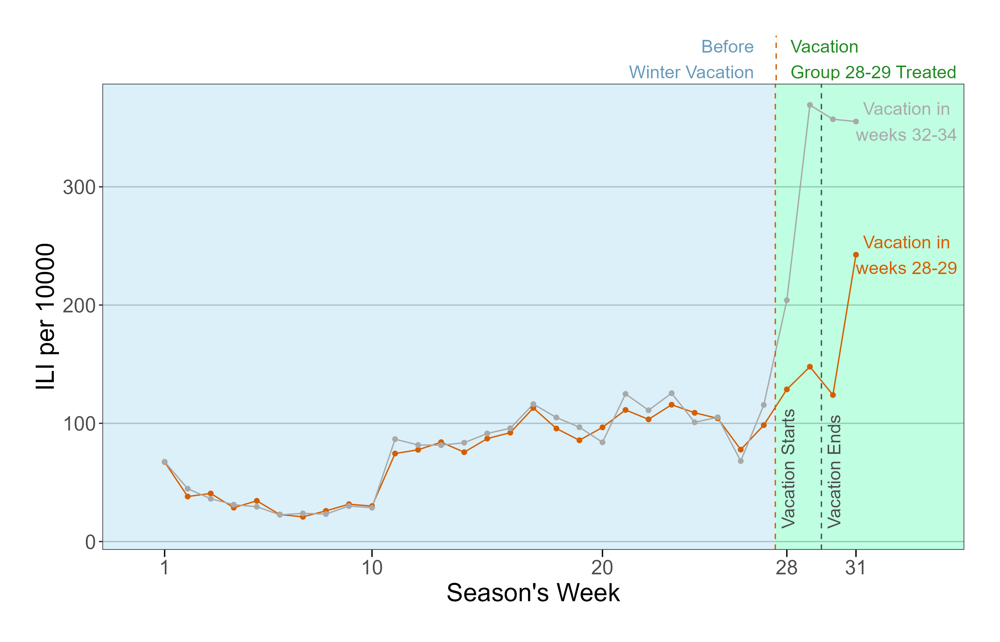

Click on an arrow to see the abstract

## Working Papers
 
 <b> <a href="https://krzysztofzaremba.github.io/files/KZ_JMP.pdf" target="_blank"> The Role of Dating Markets in Shaping Maternal and Neonatal
Health: Evidence from Sex Ratios at Birth</a>  </b> 

 

 

 Abstract 

  
   

		This paper provides the first causal evidence on how the strength of women’s position in the dating market influences maternal and neonatal health outcomes. I proxy the strength of women’s position by the availability of adult male partners. I introduce a novel instrument based on randomness in sex at birth to address the endogeneity of this variable. A stronger female position in the dating market leads to a reduction in out-of-wedlock births, lowers rates of chlamydia and hypertension in mothers, and decreases the incidence of low APGAR scores in newborns. Connecting this to racial health disparities, Black women’s limited partner prospects contribute to 5-10% of the racial health gap. Eliminating racial disparities in incarceration would prevent 200-700 adverse outcomes annually among Black mothers.

   
 

 

 

 
 <b> <a href="https://krzysztofzaremba.github.io/files/Household_penalty_Chicago.pdf" target="_blank"> Household Penalty</a>  </b> with Xinming Du 
 
 

 

 Abstract 

  
   

This paper examines how spousal health shocks affect gender disparity in health and labor outcomes. We define “household penalty” as the burden on family members resulting from other members’ health issues. Using insurance claims in the US, a difference-in-difference analysis shows partners’ infection increases their own infection probabilities by 1.2 pp (percentage points) for males and 2.2 pp for females. Mexican labor surveys show women’s labor supply decreases by 4.6 hours after their partner’s health shock, while men experience a 3-hour reduction. The mechanism lies in household specialization: as women’s income share increases, their penalty decreases, while men’s penalty increases.

   

 

## Published Papers

 <b> <a href="https://krzysztofzaremba.github.io/files/KZ_Flu.pdf" target="_blank"> School Closures and Respiratory Infections Transmission and Mortality: Evidence from School Holidays in Poland</a> </b> <em> American Journal of Epidemiology, 2024 </em> 

 Abstract 

  

 

This study examines the impact of temporary school closures on influenza transmission and respiratory mortality, leveraging a natural experiment from winter break timings in Polish schools. Analyzing 12 years of ILI (Influenza-Like Illness) data and two decades of respiratory death records, findings indicate significant reductions in ILI incidence post-closures: 75% among schoolaged children, 55% in adults, 52% in pre-school children, and 41% in the elderly. Notably, a 7% decrease in respiratory mortality was observed among the elderly, highlighting school closures as an effective public health intervention for reducing influenza spread and mortality among high-risk groups.

  

   

 

 

 

 <b> <a href="https://krzysztofzaremba.github.io/files/Hotels_Opening_KZ.pdf" target="_blank"> Opening of hotels and ski facilities: Impact on mobility, spending, and Covid-19 outcomes</a> </b> <em> Health Economics, 2023. </em>   

 

 Abstract

  

 

 
This paper investigates how reopening hotels and ski facilities in Poland impacted tourism spending, mobility, and COVID-19 outcomes. We used administrative data from a government program that subsidizes travel to show that the policy increased the consumption of tourism services in ski resorts. By leveraging geolocation data from Facebook, we showed that ski resorts experienced a significant influx of tourists, increasing the number of local users by up to 50%. Furthermore, we confirmed an increase in the probability of meetings between pairs of users from distanced locations and users from tourist and non-tourist areas. As the policy impacted travel and gatherings, we then analyzed its effect on the diffusion of COVID-19. We found that counties with ski facilities experienced more infections after the reopening. Moreover, counties strongly connected to the ski resorts during the reopening had more subsequent cases than weakly connected counties. Cost-benefit analysis shows that costs stemming from additional hospitalizations and deaths vastly outweighed the economic benefits of reopening, even in the ski resorts.
  
 

 
  

 

 
  

## Work in Progress

<b>  Intergenerational Health Consequences of Air Pollution </b> with Xinming Du 

<b>  Beware of Fake Friends: Spurious Links and Peer Effects in Networks</b>

 <b>  Prescription Drug Subsidies: Effects on Drugs’ Consumption, Health Outcomes, and Financial Well-Being </b> with Gosia Majewska 

